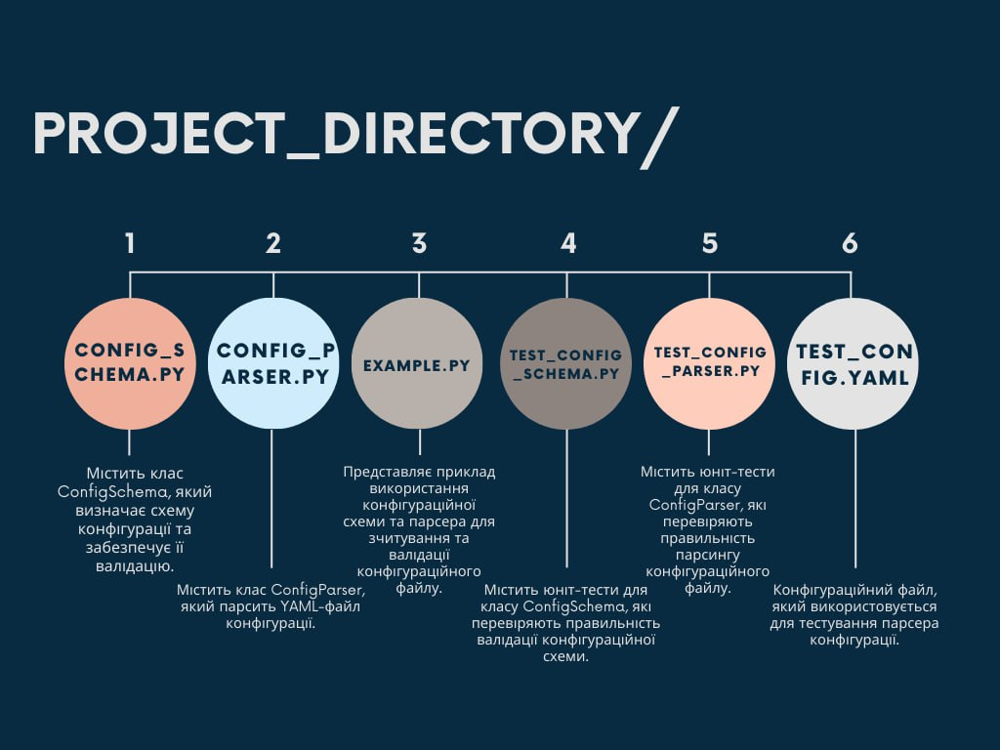
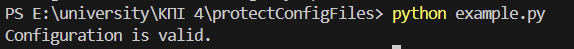
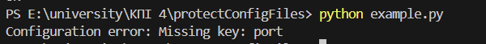
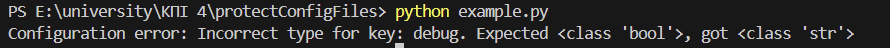
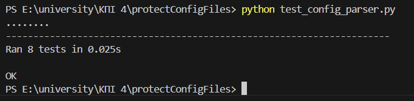
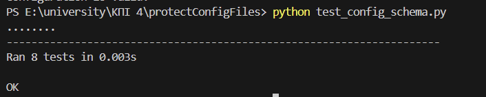
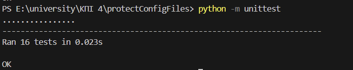

# Дизайн документ

**Виконали:** 

*студент 3-го курсу, групи ІМ-23*<span padding-right:5em></span> **Гарачун Олександр, @aleksandrgarachun**

*студентка 3-го курсу, групи ІМ-23*<span padding-right:5em></span> **Гуменюr Катерина, @ekaterynah**


**Перевірив:**
**Таран Владислав Ігорович**

### Цілі 
1. Створення схеми конфігурації: Розробка модуля, який дозволяє визначати структуру конфігураційного файлу за допомогою заданої схеми.

2. Парсинг конфігураційного файлу: Реалізація модулю для зчитування та парсингу конфігураційного файлу у форматі YAML.

3. Валідація конфігурації: Перевірка коректності конфігураційного файлу згідно з визначеною схемою.

4. Написання тестів: Розробка набору тестів для перевірки правильності роботи програми.

5. Демонстрація використання: Написання прикладу використання програми для показу її можливостей.

### Підсистема
##### Структура програми має наступний вигляд:


## Контекст

У сучасних програмних проектах часто виникає потреба у зручному та ефективному управлінні конфігураційними файлами. Це особливо актуально для веб-додатків, серверів, мікросервісів та інших систем, де конфігурація може значно впливати на роботу програми. Відповідно, створення інструментів для роботи з конфігураціями стає важливим завданням для розробників.

### Мета

Метою цього проекту є створення бібліотеки для роботи з конфігураційними файлами, яка включатиме в себе опис схеми конфігурації, парсер файлу конфігурації та валідацію конфігурації згідно зі схемою. Основною метою є спрощення та стандартизація процесу роботи з конфігураціями для програмних проектів.

### Тема роботи

Тема роботи полягає в розробці програмного забезпечення для роботи з конфігураційними файлами, яке буде включати в себе реалізацію схеми конфігурації, парсера для зчитування та розбору файлів конфігурації, а також механізм валідації конфігурації згідно зі схемою.

### Goals

Розробка бібліотеки для роботи з конфігураціями, яка буде проста у використанні та забезпечуватиме валідацію конфігураційних файлів згідно з визначеною схемою.
Забезпечення гнучкості та розширюваності бібліотеки для використання в різних програмних проектах.
Надання документації та прикладів використання для полегшення інтеграції та розуміння роботи бібліотеки.

### Non-goals

Реалізація інтерфейсу користувача або іншого зовнішнього інтерфейсу для роботи з конфігураціями.
Розробка механізмів зберігання або пересилання конфігураційних файлів.

## Аналіз можливих рішень

Секція "System Design"

У цьому розділі ми розглянемо різні аспекти дизайну системи для роботи з конфігураційними файлами у форматі YAML.

1. Мова програмування: Для реалізації програми можна використовувати будь-яку мову програмування, що підтримує роботу з YAML-файлами та має зручні бібліотеки для цього. Наприклад, Python, JavaScript або Java.

2. Архітектура програми: Можна обрати монолітну або мікросервісну архітектуру. У випадку монолітної архітектури всі функції програми будуть реалізовані у одному додатку. У мікросервісній архітектурі програма буде розділена на окремі сервіси, які виконують певні функції.

3. Зберігання схеми конфігурації: Ми можемо зберігати схему конфігурації у вигляді внутрішньої структури даних у програмі або у зовнішньому файлі у форматі JSON або YAML.

4. Методи валідації: Для валідації конфігурації можна використовувати різні методи, такі як використання статичних правил валідації, використання схеми конфігурації або валідацію на основі правил дійсності (business rules).

# Інструкція щодо запуску програми для роботи з конфігураційними файлами

Цей проект містить програму для роботи з конфігураційними файлами у форматі YAML. За допомогою цієї програми можна визначити структуру конфігурації, зчитати та валідувати конфігураційні файли.

## Початок роботи

1. **Інсталяція залежностей**:
   Переконайтеся, що у вас встановлено Python версії 3.x.
   
2. **Клонування репозиторію**:
   Клонуйте цей репозиторій на ваш комп'ютер за допомогою команди:

   ```bash
   git clone https://github.com/your_username/repository_name.git
   ```
   
3. Установка додаткових залежностей::
     ```bash
   pip install -r requirements.txt
   ```
## Використання

1. Запуск прикладу:
    ```bash
    python example.py
   ```
2. Запуск тестів:

   ```bash 
   python test_config_schema.py
   ```

    ```bash
   python test_config_parser.py
   ```

### Тестування з правильною конфігурацією

Початковий файл config.yaml:
```
database:
  host: "localhost"
  port: 5432
  username: "user"
  password: "pass"
debug: true
logfile: "/var/log/app.log"
```



### Тестування з неправильною конфігурацією

1. Видалення ключа:

Змініть config.yaml, видаливши ключ port:
```
database:
  host: "localhost"
  username: "user"
  password: "pass"
debug: true
logfile: "/var/log/app.log"
```



2. Неправильний тип значення:

Змініть тип значення port на рядок:
```
database:
  host: "localhost"
  port: "5432"
  username: "user"
  password: "pass"
debug: true
logfile: "/var/log/app.log"
```


3. Неправильний тип для `debug`:

Змініть тип значення debug на рядок:
```
database:
  host: "localhost"
  port: 5432
  username: "user"
  password: "pass"
debug: "true"
logfile: "/var/log/app.log"
```



### Тести









## Висновок

Цей проект надає набір інструментів Python для роботи з YAML-файлами конфігурації, що робить його цінним доповненням до вашого арсеналу розробки. Він пропонує значні переваги:

1. #### Зменшення помилок:

    Запобігає помилкам, які можуть виникнути через неправильні або неповні конфігурації.
    Гарантує, що ваша програма працює надійно та передбачувано.

2. #### Підвищення продуктивності:

    Зрозуміла схема конфігурації полегшує читання та розуміння конфігураційних файлів.
    Автоматизована валідація конфігурації економить час на ручному перевірці.

3. #### Гнучкість та розширюваність:

    Підходить для проектів різного масштабу та складності.
    Може бути розширений для додавання додаткових функціональних можливостей, таких як шифрування або автоматичне оновлення.

Загалом, парсер та валідатор конфігураційних файлів Python є цінним інструментом для будь-якого розробника, який працює з YAML-файлами конфігурації. Він допомагає підвищити якість, надійність та продуктивність вашого коду.


```